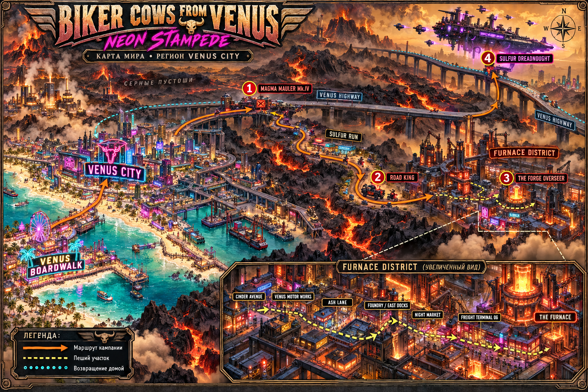

# Карта мира

Карта показывает известный регион мира игры: искусственное побережье Venus Boardwalk, Venus City, серные пустоши, Venus Highway, обход Sulfur Run и промышленный Furnace District. В увеличенной вставке отмечены семь участков пешего маршрута.

Порядок кампании задают пронумерованные встречи: **1. Magma Mauler Mk.IV → 2. Road King → 3. The Forge Overseer → 4. Sulfur Dreadnought**. После освобождения Furnace District героини возвращаются на магистраль для финального боя. Голубой пунктир обозначает возвращение домой после победы.

Это художественная схема региона, а не карта всей поверхности планеты или точный план игровых коллизий. Расположение объектов, береговая линия и ориентация предложены для визуализации; расстояния и географические координаты документацией не установлены. Основа: [мир и история](narrative.md), [сценарий кампании](story.md).

Изображение создано встроенным инструментом imagegen. Полный использованный [промпт](world-map-prompt.txt) сохранён рядом. Итоговый файл: [venus-world-map-v1.png](images/venus-world-map-v1.png).
